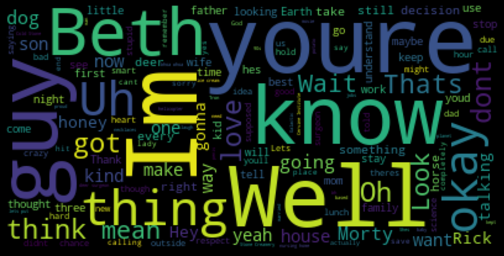

# Project 4: Rick and Morty API


The aim of this project is to create an API connected to a SQL Database. The database I have used get information from a CSV file that contains the details of the lines of several Rick and Morty episodes. 

The CSV file has been downloaded from Kaggle: https://www.kaggle.com/datasets/andradaolteanu/rickmorty-scripts

The file once uploaded into SQL and built the connection has the following structure:


I have worked using the Visual Studio Code in the following files in order to build this new API (currently not in a public server):

- sql_connection.py: create the connection between my python notebooks and MySQL Workbench (inside config folder).
- sql_queries.py: functions with the SQL queries that will feed the main.py functions (inside the tools folder).
- main.py: The API creation and different URLs that will display the queries.

My API will have different paths to GET information and will have the ability to generate new inputs of data with the POST functionality.

The **Home address** of my API will be the following:

```python 
http://localhost:9000/
```

**GET functions**

1. Get **everything**. This request will get all the information that is stored in my Database.
```python 
http://localhost:9000/everything/
```
2. Get **details from character**. This request will get all the information that is stored in my Database related to a specific character.
```python 
http://localhost:9000/details/<name>
```
3. Get **sentiment of each line from a character**. This request will pass a sentiment analysis to all lines said by a character.
```python 
http://localhost:9000/sa/<name>/
```
4. Gets **the average sentiment of all lines from a character**. Similar to the previous request, this request will return the average sentiment of all the lines said by a character.
```python 
http://localhost:9000/avg_sa/<name>/
```
5. Get **all sentiments**. This request will return a dictionary where Key = Character name and Value = average sentiment of the character.
```python 
http://localhost:9000/all_sentiments
```
6. Get **episodes**. This request will return all the episodes names that are stored in my Database.
```python 
http://localhost:9000/episodes
```
7. Get **count_lines**. This request will counts the lines that belong to each character.
```python 
http://localhost:9000/count_lines
```

**POST**
In order to post we will to execute the following in a Jupiter Notebook:
```python 
headers = {"season_no":"-", "episode_no":"-", "episode_name":"-", "character_name":"-", "line":"-"}

request.post("http://localhost:9000/post", params= headers)
```
The headers contains is a dictionary where keys are the name of the columns from my SQL table, and the value the content that will be inputed into the database in a new row.

Additionally to this I have analyzed the most used words for the main characters. These are the word clouds for Rick, Morty, Summer, Beth and Jerry.

**Rick Wordcloud**


**Morty Wordcloud**


**Summer Wordcloud**


**Beth Wordcloud**


**Jerry Wordcloud**



